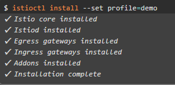
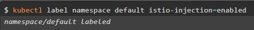

# Demostración de la aplicabilidad de Istio en un Clúster K8s ☁

**Disclaimer**: Este repositorio contiene una copia de Istio, todos los archivos han sido descargados del [GitHub Oficial de Istio](https://github.com/istio/istio/releases) y pertenecen a sus respectivos autores.

Esta demo es un acercamiento al concepto de Service Mesh en un Clpuster de K8s provisto en IBM Cloud usando Istio y el Dashboard Kiali.

Usaremos Istio para administrar configuraciones al Load Balancer, crear rutas entre servicios, realizar transiciones ágiles entre versiones de un servicio y visualizar nuestro Service Mesh con Kiali.

<br />

## 📑 Tabla de contenido

1. [Requisitos](#Requisitos)
2. [Hands On!](#-hands-on)
3. [Configuración de Istio en IKS](#-Configuración-de-Istio-en-IKS)
4. [Despliegue de la aplicación](#-Despliegue-de-la-aplicación)
5. [Dashboard Kiali](#-Dashboard-Kiali)
6. [Despliegue de servicio de base de datos MongoDB](#-Despliegue-de-servicio-de-base-de-datos-MongoDB)
7. [Referencias y documentación útil](#-Referencias-y-documentación-útil)
<br />

## 📰 Requisitos

- Tener un servicio **[Kubernetes Cluster (IKS)](https://cloud.ibm.com/kubernetes/clusters)** disponible en la cuenta IBM Cloud.

  **Importante:** Debe ser un Clúster **pago** en plan **Standard**, puede ser en infraestructura clásica o *VPC*.

- :cloud: [IBM Cloud CLI](https://cloud.ibm.com/docs/cli?topic=cloud-cli-getting-started&locale=en)
- :whale: [Docker](https://www.docker.com/products/docker-desktop)
- [kubectl](https://kubernetes.io/docs/tasks/tools/install-kubectl/). La version de esta herramienta debe ser compatible con la version de IKS que se desplegó en la cuenta.
- Complemento [container-service/kubernetes-service](https://cloud.ibm.com/docs/cli?topic=cli-install-devtools-manually) para ibmcloud CLI. `ibmcloud plugin install container-service/kubernetes-service`
<br />

## ✋ Hands On!

### ⚙ Configuración de Istio en IKS

1. Clone este repositorio y configure las variables de entorno de nuestro ambiente. Para ello, ubíquese en la carpeta clonada del repositorio y coloque: 

   * Linux o OSX: 
   ```export PATH=$PWD/bin:$PATH```
   <br />

   * Windows - PowerShell:
   ```powershell
   $path = [Environment]::GetEnvironmentVariable('PATH', 'User')
   $ruta = $PWD
   $newpath = $path + $ruta +'\bin'
   [Environment]::SetEnvironmentVariable("PATH", $newpath, 'User')
   ```
   <br />

2. Configuración del Cluster IKS.
   * Inicie sesión en *IBM Cloud* con el comando:
   ```
   ibmcloud login --sso
   ```
   <br />

   * Seleccione la cuenta en donde se encuentra su clúster de Kubernetes.
   <br />

   * Una vez ha iniciado sesión, configure el grupo de recursos y la región que está utilizando su clúster de Kubernetes. Para ello utilice el siguiente comando:
   ```
   ibmcloud target -r <REGION> -g <GRUPO_RECURSOS>
   ```
   >**Nota**: Reemplace \<REGION> y <GRUPO_RECURSOS> con su información.
   <br />

   * Obtenga la lista de clústers de Kubernetes que hay en la cuenta establecida en el ítem 2:
   ```
   ibmcloud cs clusters
   ```
   <br />

   * Verifique el nombre del clúster (```\<cluster_name>```) en el que va a trabajar y habilite el comando ```kubectl``` de la siguiente manera:
   ```
   ibmcloud ks cluster config --cluster <cluster_name>
   ```
   <br />

3. Instalar Istio en nuestro clúster

   Para efectos de esta demo definimos el perfil demo incluido en el repositorio. Usando el comando `istioctl install --set profile=demo` se instalará y configurará Istio en el clúster.

   <p align=center></p>
   <br />

4. Habilite la inyección automática de Istio al Envoy Sidecar del clúster

   Esto se realiza para un namespace determinado, en este caso use el namespace por defecto (```default```). Coloque el comando:

   `kubectl label namespace default istio-injection=enabled`

   <p align=center></p>
   <br />


### 🚀 Despliegue de la aplicación

1. Aplicación bookinfo.

   Vamos a desplegar la aplicación de ejemplo Bookinfo que está en la carpeta ```samples``` del repositorio, usando el comando:

   `kubectl apply -f samples/bookinfo/platform/kube/bookinfo.yaml`

   Este comando creará todo el despliegue en el clúster, es decir, Deployment, Service, Pods y réplicas.

   Visualice los servicios implementados en el clúster con el comando:

   `kubectl get services`

   <p align=center></p>
   <br />

   Visualice los pods implementados en el clúster con el comando:

   `kubectl get pods`

   <p align=center></p>
   <br />

2. El paso siguiente consiste en exponer al exterior el clpuster y definir las políticas de acceso. Para ello, se debe configurar la aplicación para aceptar trafico externo, agregando el Istio Ingress Gateway, que se encargará de gestionar las rutas de nuestro Service Mesh.

   Por defecto, el ingress gateway se encarga de bloquear todas las solicitudes, permitiendo únicamente las definidas en las políticas de acceso. Utilice el comando:

   `kubectl apply -f samples/bookinfo/networking/bookinfo-gateway.yaml`

   <p align=center></p>
   <br />

3. Defina tambien la configuración de enrutamiento, donde se especifica a que servicios se puede acceder desde el exterior, aplicando el archivo destination-rule-all.yaml mediante el comando:

   `kubectl apply -f samples/bookinfo/networking/destination-rule-all.yaml`

   <p align=center></p>
   <br />

4. Para continuar con el ejercicio y ejecutar la aplicación, utilice los siguientes comandos:

   ### Clúster de Infraestructura Clásica 
   <br />
   Si trabaja con un clúster de infraestructura clásica, deberá obtener la dirección ip y el puerto. Para ello siga estos pasos:

   * Obtener Dirección IP:

   `kubectl -n istio-system get service istio-ingressgateway -o jsonpath='{.status.loadBalancer.ingress[0].ip}'`

   <p align=center></p>
   <br />

   * Obtener Puerto:

   Terminal de Linux & OSX

   `kubectl -n istio-system get service istio-ingressgateway -o jsonpath='{$.spec.ports[?(@.name=="http2")].nodePort}'`
   <br />

   PowerShell:

   `kubectl -n istio-system get service istio-ingressgateway -o jsonpath='{$.spec.ports[?(@.name==\"http2\")].nodePort}'`

   <p align=center></p>
   <br />

   Ahora verifique que sea posible acceder mediante el comando:

   `curl -o /dev/null -s -w "%{http_code}\n" http://169.63.6.234/productpage`

   La salida debe ser 200

   <p align=center>

   Tambien por el navegador accediendo a la dirección `http://169.64.6.235/productpage`

   <p align=center></p>
   <br />


   ### Clúster en VPC
   <br />
   Si trabaja con un clúster en VPC, deberá obtener el endpoint. Para ello siga estos pasos:

   * Obtener endpoint:

   `kubectl -n istio-system get service istio-ingressgateway -o jsonpath='{.status.loadBalancer.ingress[0].hostname}''`
   <br />

   Ahora verifique que sea posible acceder a la aplicación por el navegador accediendo a la dirección con:
   ```
   http://<endpoint>/productpage
   ```

   Ejemplo:
   ```
   http://http://3401ba17-us-south.lb.appdomain.cloud/productpage/productpage
   ```

   <br />


## 💻 Dashboard Kiali

Istio viene por defecto con Kiali. Para visualizar el Service Mesh vaya a la carpeta ```bin``` coloque el comando:

`.\istioctl dashboard kiali` o `istioctl dashboard kiali`

Para acceder en las credenciales de usuario y contraseña coloque **admin**.

<p align=center></p>
<br />


### 📋 Captura de datos en Kiali

Seleccione en el panel izquierdo ```Graph``` y filtre por el namespace, en este caso Default. Como no se han generado solicitudes a la aplicación y el resultado de la gráfica será:  **Empty Graph**.

Para generar una cantidad considerable de solicitudes, y así poder visualizar el tráfico en el Service Mesh, usar el comando:

### Windows PowerShell:

* Clúster en infraestructura clásica:
```powershell
$i = 1
do
{
   $Response = Invoke-WebRequest -URI http://169.63.6.234/productpage
   $Response.StatusCode
   $i++
}
while ($i -le 10)
```

* Clúster en VPC:
```powershell
$i = 1
do
{
   $Response = Invoke-WebRequest -URI http://3401ba17-us-south.lb.appdomain.cloud/productpage
   $Response.StatusCode
   $i++
}
while ($i -le 10)
```

### Linux & OSX:

* Clúster en infraestructura clásica:

```bash
for ((i = 0; i < 10; i++)); do
    curl -o /dev/null -s -w "%{http_code}\n" http://169.63.6.234/productpage
done
```

* Clúster en VPC:
```bash
for ((i = 0; i < 10; i++)); do
    curl -o /dev/null -s -w "%{http_code}\n" http://3401ba17-us-south.lb.appdomain.cloud/productpage
done
```
<br />

En el panel lateral izquierdo seleccione Graph. 
En la pestaña Display ➡ sección Show Edge Labels ➡ seleccione Request Percentage.
En la pestaña Display ➡ sección Show ➡ seleccione Compress Hidden, Node Names, Service Nodes y Traffic Animation.

<p align=center></p>
<br />


## 📚 Despliegue de servicio de base de datos MongoDB

1. Ejecute el comando para desplegar el servicio:

   `kubectl apply -f samples/bookinfo/platform/kube/bookinfo-db.yaml`
   <br />

2. Compruebe que se haya creado un nuevo servicio de mongodb, con el comando:

   `kubectl get services`
   <br />

3. Despliegue una nueva versión del servicio de ratings que consume el servicio de mongodb, para ello coloque el comando:

`kubectl apply -f samples/bookinfo/platform/kube/bookinfo-ratings-v2.yaml`
<br />

4. Para poder visualizar en Kiali las versiones, de click la lista que se encuentra al lado derecho del Namespace y seleccione la opción Versioned app graph:

<p align=center></p>
<br />


### 🔐 Definición de políticas de acceso a nuestra base de datos
Es necesario definir nuevas políticas de acceso por medio del enrutamiento del Ingress Gateway a la nueva versión del servicio ratings y al servicio mongodb. Para ello utilice los comandos:

```bash
kubectl apply -f samples/bookinfo/networking/destination-rule-all-mtls.yaml
kubectl apply -f samples/bookinfo/networking/virtual-service-ratings-db.yaml
```
<br />

Solicite nuevamente peticiones a la aplicación con el fin de recibir tráfico en Kiali. Utilice los comandos indicados en [Captura de datos en Kiali](#captura-de-datos-en-kiali).

Finalmente, Kiali mostrará tráfico entrante al servicio de mongodb.

<p align=center></p>
<br />


## 📍 Referencias y documentación útil

- [Documentación Kiali](https://istio.io/docs/tasks/observability/kiali/)

- [Documentación Inicial Istio](https://istio.io/docs/setup/getting-started/#install)

- [IBM Cloud Docs Istio](https://cloud.ibm.com/docs/containers?topic=containers-istio-qs)

- [Manejo de Políticas con Istio](https://istio.io/docs/tasks/policy-enforcement/denial-and-list/)

- [Autorización de servicios TCP Istio](https://archive.istio.io/v1.3/docs/tasks/security/authz-tcp/)

- [Iniciación a Istio](https://cloud.ibm.com/docs/containers?topic=containers-istio-qs)
<br />

## ✒ Autores
Equipo *IBM Cloud Tech Sales Colombia*.
