# Aplicabilidad de Istio en Clúster de Kubernetes ☁

**Disclaimer**: Este repositorio contiene una copia de Istio, todos los archivos han sido descargados del [GitHub Oficial de Istio](https://github.com/istio/istio/releases) y pertenecen a sus respectivos autores.

Esta demo es un acercamiento al concepto de Service Mesh en un Clúster de K8s provisto en IBM Cloud usando Istio y el Dashboard Kiali.

Usaremos Istio para administrar configuraciones al Load Balancer, crear rutas entre servicios, realizar transiciones ágiles entre versiones de un servicio y visualizar nuestro Service Mesh con Kiali.

<br />

## Tabla de contenido 📑

1. [Requisitos](#Requisitos-newspaper)
2. [Configuración de variables de entorno y acceso al clúster](#Configuración-de-variables-de-entorno-y-acceso-al-clúster-gear)
3. [Instalación de Istio en el Clúster](#Instalación-de-Istio-en-el-Clúster-cloud)
4. [Instalación de Kiali y Prometheus en el Clúster](#Instalación-de-Kiali-y-Prometheus-en-el-Clúster-chart_with_upwards_trend)
5. [Instalación y prueba de Jaeger](#Instalación-y-prueba-de-Jaeger-tophat)
6. [Despliegue de la aplicación](#Despliegue-de-la-aplicación-rocket)
7. [Dashboard Kiali](#Dashboard-Kiali-computer)
8. [Captura de datos en Kiali](#Captura-de-datos-en-Kiali-clipboard)
9. [Despliegue de servicio de base de datos MongoDB](#Despliegue-de-servicio-de-base-de-datos-MongoDB-books)
10. [Definición de políticas de acceso a la base de datos](#Definición-de-políticas-de-acceso-a-la-base-de-datos-closed_lock_with_key)
11. [Referencias](#Referencias-mag)
12. [Autores](#Autores-black_nib)
<br />

## Requisitos :newspaper:

- Tener un servicio **[Kubernetes Cluster (IKS)](https://cloud.ibm.com/kubernetes/clusters)** disponible en la cuenta IBM Cloud.

  **Importante:** Debe ser un Clúster **pago** en plan **Standard**, puede ser en infraestructura clásica o *VPC*.

- :cloud: [IBM Cloud CLI](https://cloud.ibm.com/docs/cli?topic=cloud-cli-getting-started&locale=en)
- :whale: [Docker](https://www.docker.com/products/docker-desktop)
- [kubectl](https://kubernetes.io/docs/tasks/tools/install-kubectl/). La version de esta herramienta debe ser compatible con la version de IKS que se desplegó en la cuenta.
- Complemento [container-service/kubernetes-service](https://cloud.ibm.com/docs/cli?topic=cli-install-devtools-manually) para ibmcloud CLI. `ibmcloud plugin install container-service/kubernetes-service`.
- Tener instalado [Helm V3](https://github.com/helm/helm/releases) en su computador para instalar el operador de Kiali (para ambientes de producción).
<br />


## Configuración de variables de entorno y acceso al clúster :gear:

1. Clone este repositorio y configure las variables de entorno del ambiente. Para ello, ubíquese en la carpeta clonada del repositorio y en la ruta ```Kubernetes-Seguridad-Istio\istio-1.10.3``` y coloque: 

   * Linux o OSX: 
   ```export PATH=$PWD/bin:$PATH```
   <br />

   * Windows - PowerShell:
   ```powershell
   $path = [Environment]::GetEnvironmentVariable('PATH', 'User')
   $ruta = $PWD
   $newpath = $path + $ruta +'\bin'
   [Environment]::SetEnvironmentVariable("PATH", $newpath, 'User')
   ```
   <br />

2. Configuración del Cluster IKS.
   * Inicie sesión en *IBM Cloud* con el comando:
   
   ```
   ibmcloud login --sso
   ```
   <br />

   * Seleccione la cuenta en donde se encuentra su clúster de Kubernetes.
   <br />

   * Una vez ha iniciado sesión, configure el grupo de recursos y la región que está utilizando su clúster de Kubernetes. Para ello utilice el siguiente comando:
   
   ```
   ibmcloud target -r <REGION> -g <GRUPO_RECURSOS>
   ```
   >**Nota**: Reemplace \<REGION> y <GRUPO_RECURSOS> con su información.
   <br />

   * Obtenga la lista de clústers de Kubernetes que hay en la cuenta establecida:
   
   ```
   ibmcloud cs clusters
   ```
   <br />

   * Verifique el nombre del clúster (```<cluster_name>```) en el que va a trabajar y habilite el comando ```kubectl``` de la siguiente manera:
   
   ```
   ibmcloud ks cluster config --cluster <cluster_name>
   ```
   <br />
   

## Instalación de Istio en el Clúster :cloud:

Para realizar la instalación de Istio en el clúster se porporcionan dos perfiles en esta documentación:
* [Istio demo](#Istio-demo) para ambientes no productivos.
* [Istio para producción](#Istio-para-producción).
<br />

Al momento de realizar este repositorio, la versión más reciente de Istio era la ```1.11```, pero al ser un lanzamiento reciente algunas de sus características y herramientas se encontraban en versión beta. Por este motivo, para la prueba que se presenta en esta documentación se utiliza la versión ```1.10``` para ambientes productivos y no productivos.

Para ejecutar los comandos, dentro de la capeta clonada ```Kubernetes-Seguridad-Istio\istio-1.10.3``` muévase con el comando ```cd``` hasta la carpeta ```bin``` que contiene el ejecutable de istio y allí ejecute los comandos teniendo en cuenta el perfil que desea implementar:
<br />


### Istio demo
Para instalar la versión demo de Istio (ambientes no productivos), siga los pasos que se muestran a continuación:
<br />

1. Una vez ha iniciado sesión y seleccionado el clúster en el que va a trabajar, instale la versión demo de Istio con el comando:

   ```
   istioctl install --set profile=demo
   ``` 
   
   <p align=center>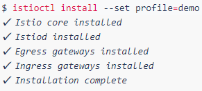</p>
   <br />

2. Habilite la inyección automática de Istio al Envoy Sidecar del clúster. Esto se realiza para un namespace determinado, en este caso use el namespace por defecto (```default```). Coloque el comando:

   ```
   kubectl label namespace default istio-injection=enabled
   ```

   <p align=center>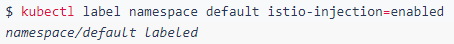</p>
   <br />
<br />

### Istio para producción
Para instalar la versión para ambiente productivos de Istio, siga los pasos que se muestran a continuación:
<br />

1. Una vez ha iniciado sesión y seleccionado el clúster en el que va a trabajar, instale la versión default de Istio con el comando:

   ```
   istioctl install --set profile=default
   ``` 
   
   <p align=center>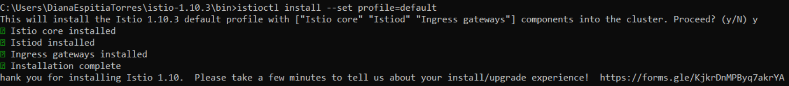</p>
   <br />

2. Habilite la inyección automática de Istio al Envoy Sidecar del clúster. Esto se realiza para un namespace determinado, en este caso use el namespace por defecto (```default```). Coloque el comando:

   ```
   kubectl label namespace default istio-injection=enabled
   ```

   <p align=center></p>
   <br />
<br />


## Instalación de Kiali y Prometheus en el Clúster :chart_with_upwards_trend:
Kiali es una consola de administración para Istio que permite controlar la malla de servicios. Esta herramienta necesita recuperar datos y configuraciones de Istio, que se exponen a través de Prometheus y la API del clúster, por lo cual, una vez instale Kiali deberá instalar Prometheus. 

Por su parte, Prometheus es una dependencia de Istio. Cuando la telemetría de Istio está habilitada, los datos de las métricas se almacenan en Prometheus para ser mostrados posteriormente en Kiali.

Para realizar la instalación de Kiali y Prometheus en el clúster se proporcionan dos opciones en esta documentación:
* [Kiali y Prometheus demo](#Kiali-y-Prometheus-demo) para ambientes no productivos.
* [Kiali y Prometheus para producción](#Kiali-y-Prometheus-para-producción).
<br />

### Kiali y Prometheus demo
Para instalar la versión demo de Kiali y Prometheus siga los pasos que se muestran a continuación:
<br />

1. Para instalar Kiali en el clúster utilice el siguiente comando:

   ```
   kubectl apply -f https://raw.githubusercontent.com/istio/istio/release-1.10/samples/addons/kiali.yaml
   ```
   
   <p align=center>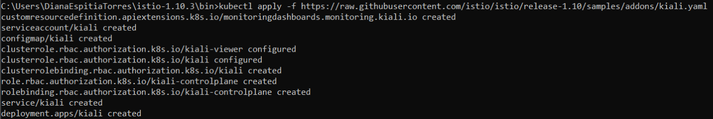</p>
   <br />

2. Para instalar Prometheus en el clúster utilice el siguiente comando:

   ```
   kubectl apply -f https://raw.githubusercontent.com/istio/istio/release-1.10/samples/addons/prometheus.yaml
   ```
   
   <p align=center>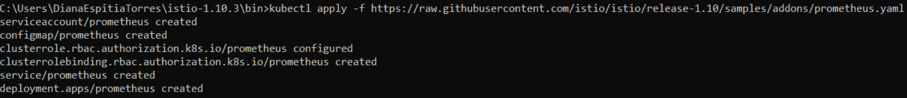</p>
   <br />

<br />

### Kiali y Prometheus para producción
Para instalar la versión de Kiali para ambientes productivos tenga en cuenta la versión de Istio empleada. En la siguiente tabla se muestra la compatibilidad entre versiones:
<br />

| ***Versión de Istio*** | ***Versión de Kiali*** |
|     :---:      |     :---:      |
| 1.11  | 1.38.1 or later |
| 1.10  | 1.34.1 to 1.37.x |
| 1.9  | 1.29.1 to 1.33.x |
| 1.8  | 1.26.0 to 1.28.x |
| 1.7  | 1.22.1 to 1.25.x |
| 1.6  | 1.18.1 to 1.21.x |

Para este caso, la versión empleada de Kiali es la ```1.37.0```. Por otro lado, para entornos de producción en Kubernetes, se debe instalar el ```Kiali Operator Helm Chart```. Durante la instalación de este operador, se instala también el Kiali CR (activa la instalación del servidor de Kiali en el namespace de istio). Para ello, complete los siguientes pasos:

1. Cree un namespace en donde quedará instalado el ```kiali-operator```, utilice el comando:

   ```
   kubectl create namespace kiali-operator
   ```
   <br />

2. Instale el ```kiali-operator``` en el namespace que acaba de crear (```kiali-operator```) junto con el servidor de Kiali en el namespace del sistema isito (```istio-system```). Asegúrese de tener instalado el comando helm (puede que deba cambiar de carpeta hasta la ubicación que contiene el ejecutable) y posteriomente coloque el comando:
   ```
   helm install --set cr.create=true --set cr.namespace=istio-system --namespace kiali-operator --repo https://kiali.org/helm-charts --version 1.37.0 kiali-operator kiali-operator 
   ```
   <br />

3. Asegúrese de que el operador de Kiali se encuentre instalado en el namespace ```kiali-operator``` y que el servidor de Kiali se encuentre en el namespace ```istio-system```.
   
   <p align=center>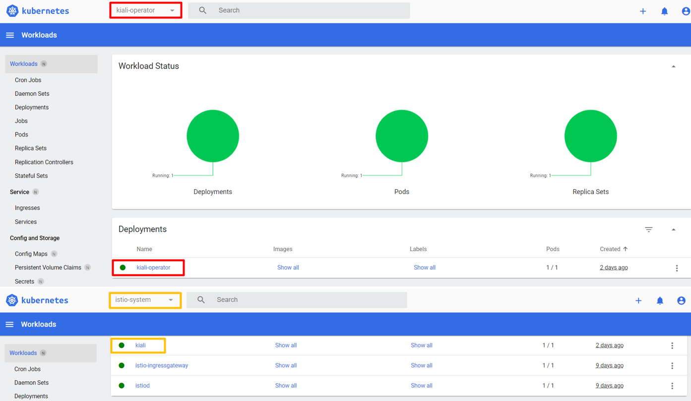</p>
   <br />

Para el caso de Prometheus, se recomienda para ambientes de producción implementar federación jerárquica y reglas. Cuando se implementa Prometheus en versión demo la ventana de retención es muy corta (6 horas), por lo cual se realizan una serie de configuraciones para contar con rangos mayores en la colección de métricas y así poder realizar monitoreo a escala de producción. 

<br />

   <p align=center>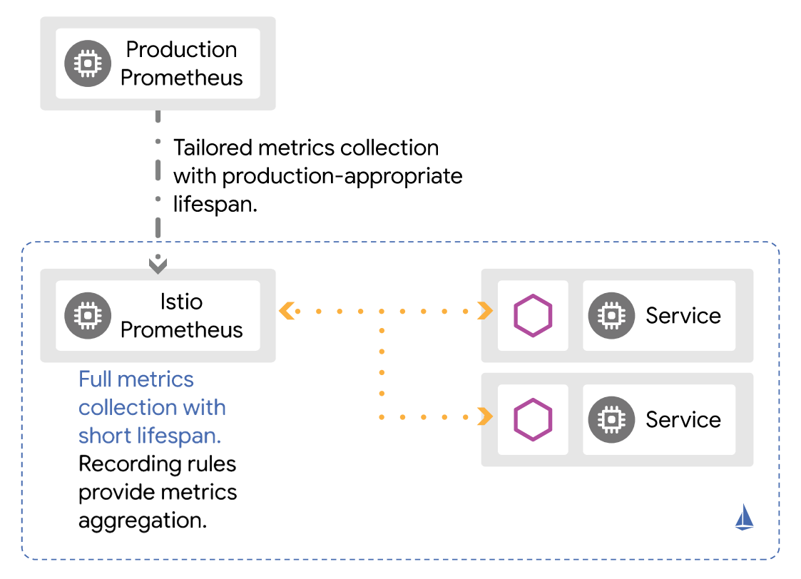</p>
   <br />

Complete los siguientes pasos para configurar Prometheus a escala de producción:

1. Para instalar Prometheus en el clúster utilice el siguiente comando:

   ```
   kubectl apply -f https://raw.githubusercontent.com/wavefrontHQ/integrations/master/istio/prometheus.yaml
   ```
   
   <p align=center>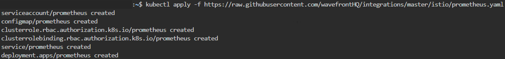</p>
   <br />
   
   > NOTA: En caso de que el enlace falle al momento de realizar la instalación, en el respositorio puede encontrar el archivo ```prometheus.yaml```que contiene las configuraciones de federación jerárquica y reglas para ambientes a escala de producción. Por lo tanto, puede utilizar ese archivo para desplegar Prometheus a escala de producción. 

2. Verifique que Prometheus se ha instalado en el namespace ```istio-system```. 

   <p align=center>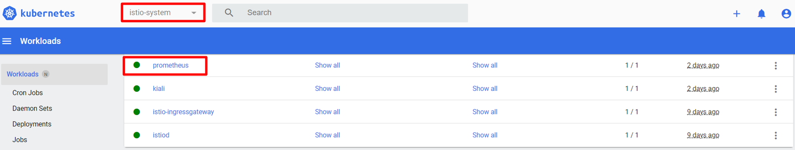</p>
<br />

## Instalación y prueba de Jaeger :tophat:

### Instalación del operador de Jaeger

Jaeger es un sistema de software open source que sirve para detectar operaciones entre los servicios distribuidos. Se utiliza para supervisar entornos complejos de microservicios y solucionar los problemas asociados a ellos. Para trabaja Jaeger en un ambiente de producción, lo más recomendable es instalar el operador Jaeger, a continuación se detallan los pasos para instalar Jaeger en su clúster de Kubernetes, utilizando las plantillas utilizadas en la documentación oficial de Jaeger:

1.  Cree la definición de recurso personalizada requerida por el operador de Jaeger:

```
kubectl create -f https://raw.githubusercontent.com/jaegertracing/jaeger-operator/master/deploy/crds/jaegertracing.io_jaegers_crd.yaml
```
2. A continuación, cree una cuenta de servicio , un rol y una vinculación de roles para el control de acceso basado en roles:

```
kubectl create -f https://raw.githubusercontent.com/jaegertracing/jaeger-operator/master/deploy/service_account.yaml
kubectl create -f https://raw.githubusercontent.com/jaegertracing/jaeger-operator/master/deploy/role.yaml
kubectl create -f https://raw.githubusercontent.com/jaegertracing/jaeger-operator/master/deploy/role_binding.yaml
```
3. Finalmente, implemente el operador Jaeger:

```
kubectl create -f https://raw.githubusercontent.com/jaegertracing/jaeger-operator/master/deploy/operator.yaml
```
4. Aunque ya se tenga instalado el operador, es necesario crear un recurso que describa la instancia de Jaeger:

```
kubectl apply -f - <<EOF
apiVersion: jaegertracing.io/v1
kind: Jaeger
metadata:
  name: simplest
EOF
```
5. Para validar que Jaeger está funcionando correctamente, ejecute el siguiente comando y verifique si puede acceder a la interfaz de usuario:

```
kubectl port-forward $(kubectl get pods -l=app="jaeger" -o name) 16686:16686
```

 <p align=center>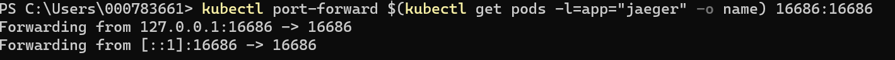</p>
 <br />
Por ahora el unico servicio que debe ver es el de Jaeger Query, ahora procederemos a implementar la aplicación que deseamos monitorear.
 

### Implementación y monitoreo de una aplicación de prueba
Dicha aplicación ha sido copiada del siguiente [tutorial](https://www.digitalocean.com/community/tutorials/how-to-implement-distributed-tracing-with-jaeger-on-kubernetes) y consiste en una aplicación sencilla que será un contador de visitas cuyo valor aumenta cada vez que se realiza un llamado al frontend. Para simular problemas de rendimiento, incluye una función de suspensión aleatoria que se ejecuta cada vez que el frontend envía una GET solicitud al backend. Esta aplicación además incluye la configuración necesaria de OpenTracing que necesita Jaeger para monitorear la aplicación. A continuación se detallan los pasos para desplegar la aplicación en el clúster de Kubernetes:

1. Dirijase a la carpeta ```sammy-jaeger``` que se encuentra en la carpeta clonada de este repositorio. A continuación asegurese que haya iniciado sesión en DockerHub con el siguiente comando:

```
docker login --username=your_username --password=your_password
```
2. Ejecute 

```
nano ./frontend/deploy_frontend.yaml
```
O el comando que le permita editar el archivo. Cambie la dirección ```username``` por su usuario de docker.

 <p align=center></p>
 <br />
 
 Pulse Ctrl+S para guardar los cambios. Y Ctrl+X para salir del editor. 
 
 3. Ejecute 

```
nano ./backend/deploy_backend.yaml
```
O el comando que le permita editar el archivo. Cambie la dirección ```username``` por su usuario de docker.

 <p align=center></p>
 <br />
 
 4. A continuación se creará la imagen en Docker, ejecute los siguiente comandos:
(Recuerde cambiar username por su usuario de DockerHub)

Para crear el backend:
 
 ```
docker build -t username/do-visit-counter-backend:v2 ./backend
docker push username/do-visit-counter-backend:v2
 ```
Para crear el frontend:

```
docker build -t username/do-visit-counter-frontend:v2 ./frontend
docker push username/do-visit-counter-frontend:v2

```
 5. Ahora enviaremos la aplicación al clúster de kubernetes:
 
 ```
kubectl apply -f ./frontend/deploy_frontend.yaml
kubectl apply -f ./backend/deploy_backend.yaml

 ```
6. Para abrir la aplicación ejecute:

```
kubectl port-forward $(kubectl get pods -l=app="do-visit-counter-frontend" -o name) 8000:8000
```

 <p align=center>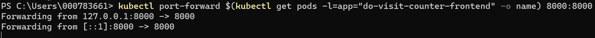</p>
 <br />
 
7. Abra la aplicación desde el browser con la dirección http://localhost:8000.

 <p align=center></p>
 <br />
 
En otra terminal no olvide estar corriendo la aplicación de Jaeger, abra la consola de Jaeger con la dirección http://localhost:16686. Debes poder visualizar el servicio ```service``` que corresponde a la aplicación desplegada.

 <p align=center>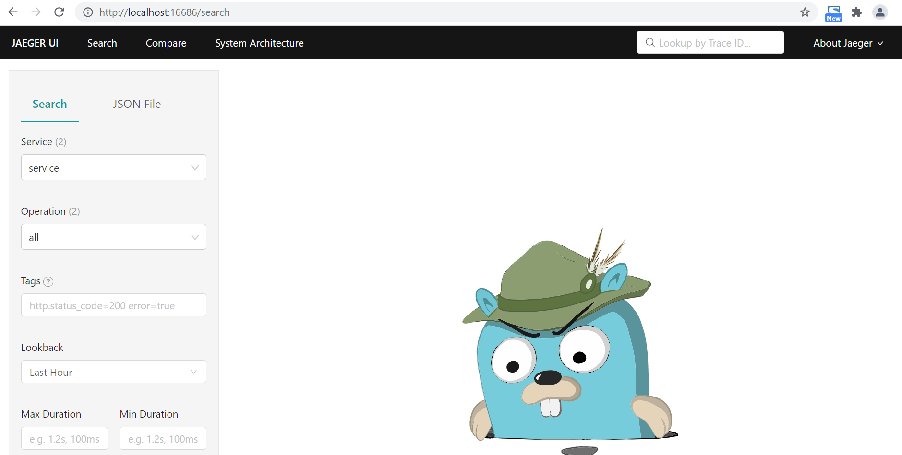</p>
 <br />

8. A continuación en otra terminal ejecute solicitudes a la aplicación para posteriormente observar el monitoreo.

```
for i in 0 1 2 3 4 5 6 7 8 9; do curl localhost:8000; done
```
9. Una vez concluido el ciclo del paso anterior, ingrese a la consola de Jaeger y complete lo siguiente:

* ```Service```: service
* ```Operation```: Puede escoger cualquiera de los servicio de la aplicación ```hello_world``` o ```counter```. O en este caso escogeremos la opción ```all``` para visualizar ambos servicios.
* ```Tags```: Esta opción le permite filtrar por la respuesta que fue entregada al cliente al momento de hacer la solicitud a la aplicación. Ejm: http.status_code=200.
* ```Lookback```: Puede elegir visualizar las solicitudes hechas en las útimas horas, según necesite puede elegir entre un rango de la última hora y las últimas 48 horas.
* ```Max Duration/Min Duration ```: Debido a que Jaeger le entrega el tiempo en que tardo la aplicación en responder a la solictud, usted puede filtrar entre los tiempos que haya tardado, que sean de su interes. 
* ```Limit Results```: Con esta opción indique a Jaeger cuantos resultados desea listar en el monitoreo que va a realizar.

Finalmente de click en ``` Find Traces``` para que se muestren los resultados. En el caso de la aplicación de ejemplo, usted podrá visualizar una primera gráfica donde se comparan las solicitudes realizadas de acuerdo a su tiempo de respuesta. Y posteriormente un resumen del tiempo y la respuesta de cada solicitud realizada por el cliente.

 <p align=center></p>
 <br />

 
 


## Despliegue de la aplicación :rocket:

1. Aplicación bookinfo.

   * El primer paso consiste en desplegar la aplicación de ejemplo Bookinfo que está en la carpeta ```samples``` del repositorio. Para ello, salga de la carpeta ```bin``` con el comando ```cd..``` y asegúrese de quedar en la ruta ```Kubernetes-Seguridad-Istio\istio-1.10.3``` donde se ubica la carpeta ```samples```. Luego coloque el comando:

     ```
     kubectl apply -f samples/bookinfo/platform/kube/bookinfo.yaml
     ```

     Este comando creará todo el despliegue en el clúster, es decir, Deployment, Service, Pods y réplicas.

   * Visualice los servicios implementados en el clúster con el comando:

     ```
     kubectl get services
     ```

     <p align=center>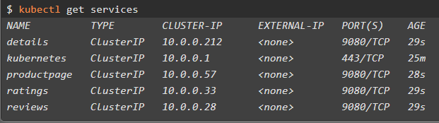</p>
     <br />

   * Visualice los pods implementados en el clúster con el comando:

     ```
     kubectl get pods
     ```

     <p align=center>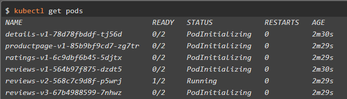</p>
     <br />

2. El paso siguiente consiste en exponer al exterior el clúster y definir las políticas de acceso. Para ello, se debe configurar la aplicación para aceptar trafico externo, agregando el Istio Ingress Gateway, que se encargará de gestionar las rutas de nuestro Service Mesh.

   Por defecto, el ingress gateway se encarga de bloquear todas las solicitudes, permitiendo únicamente las definidas en las políticas de acceso. Utilice el comando:

   ```
   kubectl apply -f samples/bookinfo/networking/bookinfo-gateway.yaml
   ```

   <p align=center>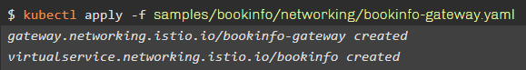</p>
   <br />

3. Defina la configuración de enrutamiento donde se especifica a que servicios se puede acceder desde el exterior. Para ello utilice el archivo destination-rule-all.yaml mediante el comando:

   ```
   kubectl apply -f samples/bookinfo/networking/destination-rule-all.yaml
   ```

   <p align=center>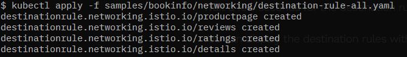</p>
   <br />

4. Para continuar con el ejercicio y ejecutar la aplicación, utilice los siguientes comandos:

   ### Clúster de Infraestructura Clásica 
   <br />
   Si trabaja con un clúster de infraestructura clásica, deberá obtener la dirección ip y el puerto. Para ello siga estos pasos:

   * Obtener Dirección IP:

   ```
   kubectl -n istio-system get service istio-ingressgateway -o jsonpath='{.status.loadBalancer.ingress[0].ip}'
   ```

   <p align=center>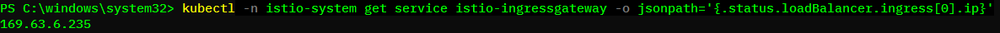</p>
   <br />

   * Obtener Puerto:

   Terminal de Linux & OSX

   ```
   kubectl -n istio-system get service istio-ingressgateway -o jsonpath='{$.spec.ports[?(@.name=="http2")].nodePort}'
   ```
   <br />

   PowerShell:

   ```
   kubectl -n istio-system get service istio-ingressgateway -o jsonpath='{$.spec.ports[?(@.name==\"http2\")].nodePort}'
   ```

   <p align=center>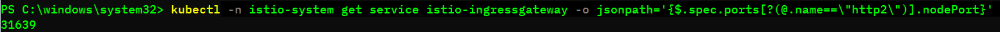</p>
   <br />

   Ahora verifique que sea posible acceder mediante el comando:

   ```
   curl -o /dev/null -s -w "%{http_code}\n" http://169.63.6.234/productpage
   ```

   La salida debe ser 200.
   
   <p align=center>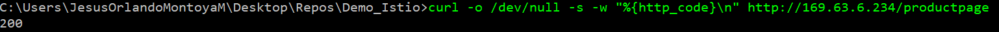
   <br />

   También puede realizar la prueba por el navegador accediendo a la dirección `http://169.64.6.235/productpage`

   <p align=center>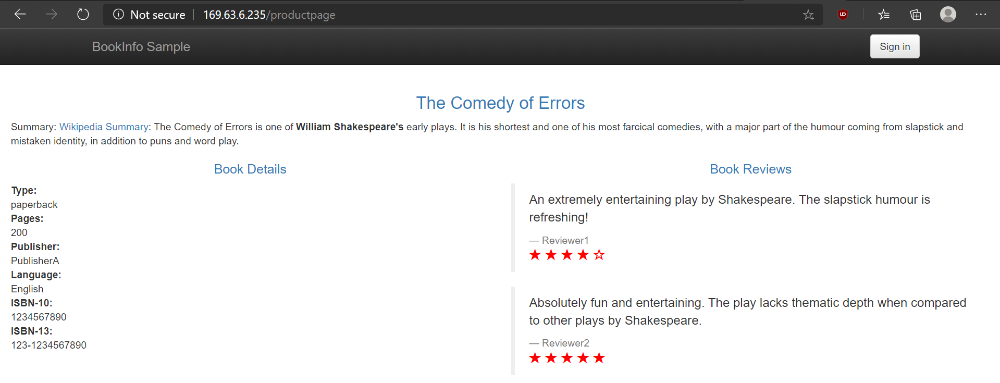</p>
   <br />


   ### Clúster en VPC
   <br />
   Si trabaja con un clúster en VPC, deberá obtener el endpoint. Para ello siga estos pasos:

   * Obtener endpoint:

   ```
   kubectl -n istio-system get service istio-ingressgateway -o jsonpath='{.status.loadBalancer.ingress[0].hostname}'
   ```
   <br />

   Ahora verifique que sea posible acceder a la aplicación por el navegador accediendo a la dirección con:
   ```
   http://<endpoint>/productpage
   ```

   Ejemplo:
   ```
   http://3401ba17-us-south.lb.appdomain.cloud/productpage
   ```

   <br />


## Dashboard Kiali :computer:

Para acceder al dashboard de Kiali, tenga en cuenta las siguientes opciones según el ambiente en el que trabaja su clúster:
* [Kiali demo](#Kiali-demo).
* [Kiali para producción](#Kiali-para-producción).
<br />


### Kiali demo
Para visualizar y acceder a Kiali en la versión para ambientes no productivos, vaya a la carpeta ```bin``` (ya que esta carpeta contiene el ejecutable de Kiali) con ```cd bin``` (que se encuentra dentro de la carpeta clonada ```Kubernetes-Seguridad-Istio\istio-1.10.3```) y coloque el comando:

```
istioctl dashboard kiali
```

Una vez aplique el comando, obtendrá como respuesta ```http://localhost:puerto```, donde puerto es un valor aleatorio. Si de forma automática no se abre esta URL en el navegador, colóquela de forma manual. Allí le aparecerá una ventana para acceder a Kiali. En las credenciales de usuario y contraseña coloque **admin**.

<p align=center>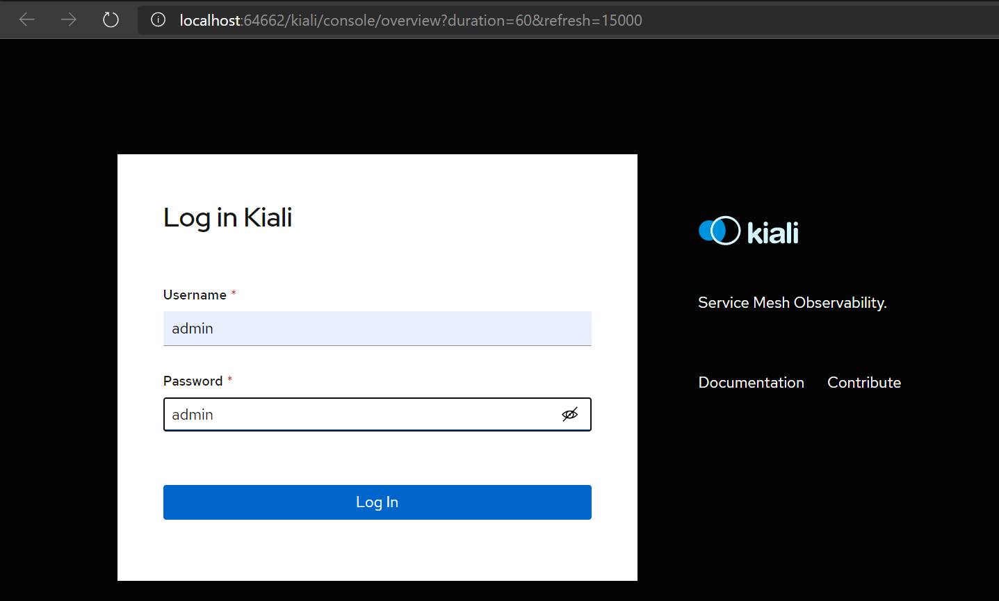</p>
<br />

### Kiali para producción
Para visualizar y acceder a Kiali en la versión para ambientes productivos, puede realizarlo de 2 formas:
<br />

* **Opción 1:**
  
  Vaya a la carpeta ```bin``` (ya que esta carpeta contiene el ejecutable de Kiali) con ```cd bin``` (que se encuentra dentro de la carpeta clonada ```Kubernetes-Seguridad-Istio\istio-1.10.3```) y coloque el comando:

  ```
  istioctl dashboard kiali
  ```

  Una vez aplique el comando, obtendrá como respuesta ```http://localhost:20001/kiali```. Si de forma automática no se abre esta URL en el navegador, colóquela de forma manual. Allí le aparecerá una ventana para acceder a Kiali. En las credenciales de acceso le piden un token del Kubernetes Service Account. Los pasos para obtener este token se presentarán más adelante.
  <br />
  
  <p align=center>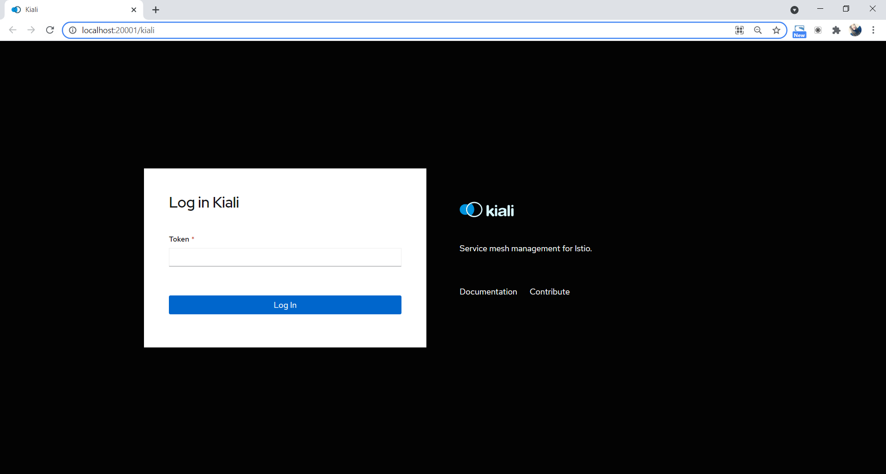</p>
  <br />

* **Opción 2:**
 
  En el overview de su clúster visualice y copie el ```Ingress subdomain```. Posteriormente colóquelo en el navegador agregando al final ```/kiali``` y espere a que la ventana cargue.

  ```
  <Ingress subdomain>/kiali
  ```
  
  <p align=center>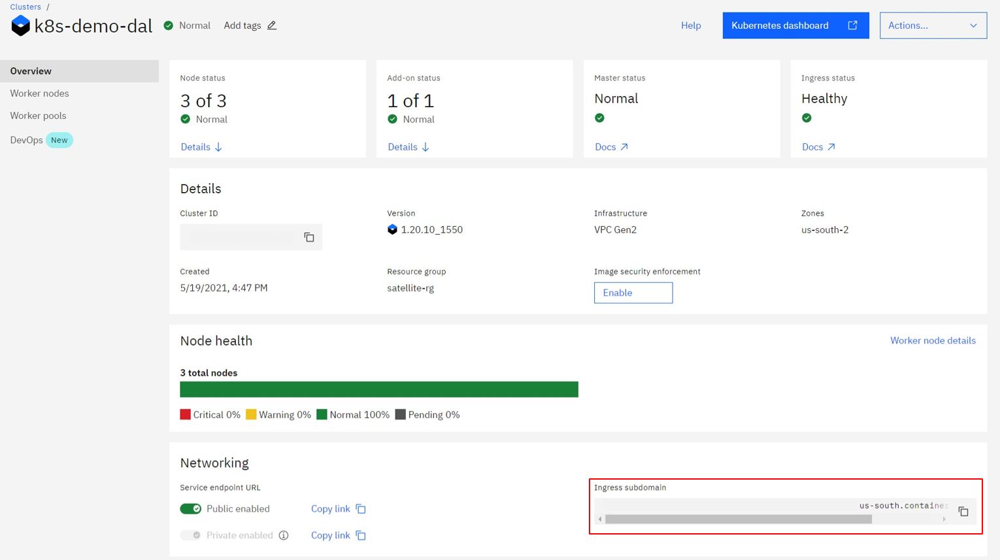</p>
  <br />
  
  En las credenciales de acceso le piden un token del Kubernetes Service Account. Los pasos para obtener este token se presentarán más adelante.
  
  <br />
  
  <p align=center>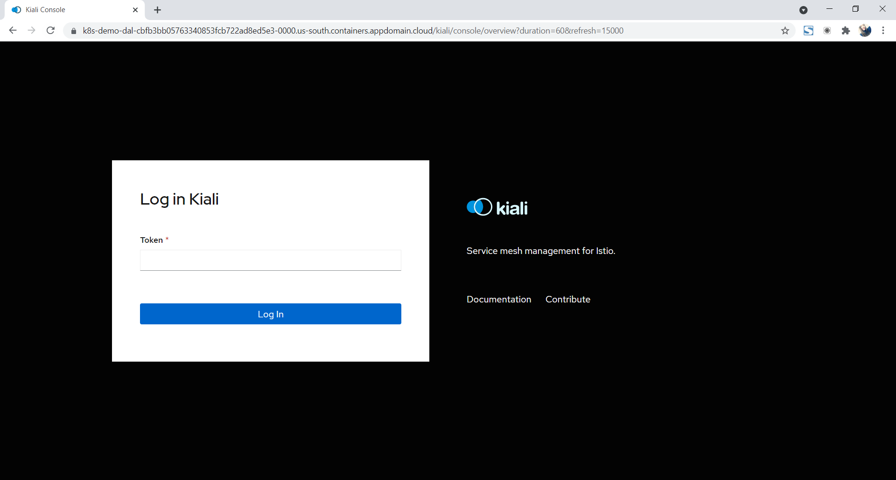</p>
  <br />
 
Para obtener el token de acceso realice lo siguiente:

1. Obtenga los secrets del namescape ```istio-system``` con el siguiente comando:
  ```
  kubectl get secrets -n istio-system
  ```
  <br />

2. Visualice el secret que corresponde a ```kiali-service-account-token-xxxxx``` y aplíquelo en el siguiente comando:
  ```
  kubectl describe secrets/kiali-service-account-token-xxxxx -n istio-system
  ```
  <br />
  
  Ejemplo:
  
  ```
  kubectl describe secrets/kiali-service-account-token-9jg27 -n istio-system
  ```
  <br />
  
  Posteriormente aparecerá el token de acceso que deberá colocar en la ventana de Kiali para acceder a las métricas.
  
  <br />
  
  <p align=center>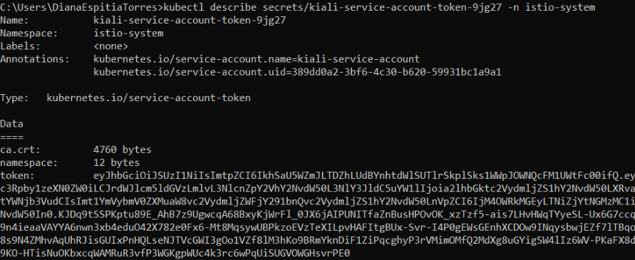</p>
  <br />


## Captura de datos en Kiali :clipboard:

Una vez a accedido a Kiali, seleccione en el panel izquierdo ```Graph``` y filtre por el namespace en el que desplegó la aplicación. Como no se han generado solicitudes a la aplicación y el resultado de la gráfica será:  **Empty Graph**.

Para generar una cantidad considerable de solicitudes y así poder visualizar el tráfico en el Service Mesh, en una nueva ventana use el comando:

### Windows PowerShell:

* Clúster en infraestructura clásica:
```powershell
$i = 1
do
{
   $Response = Invoke-WebRequest -URI http://169.63.6.234/productpage
   $Response.StatusCode
   $i++
}
while ($i -le 10)
```

* Clúster en VPC:
```powershell
$i = 1
do
{
   $Response = Invoke-WebRequest -URI http://3401ba17-us-south.lb.appdomain.cloud/productpage
   $Response.StatusCode
   $i++
}
while ($i -le 10)
```

### Linux & OSX:

* Clúster en infraestructura clásica:

```bash
for ((i = 0; i < 10; i++)); do
    curl -o /dev/null -s -w "%{http_code}\n" http://169.63.6.234/productpage
done
```

* Clúster en VPC:
```bash
for ((i = 0; i < 10; i++)); do
    curl -o /dev/null -s -w "%{http_code}\n" http://3401ba17-us-south.lb.appdomain.cloud/productpage
done
```
<br />

Revise nuevamente la ventana que muestra Kiali y asegúrese de tener seleccionado lo siguiente según la versión de Kiali implementada:

### Kiali demo
  * En el panel lateral izquierdo ➡ Graph. 
  * En la pestaña Display ➡ sección Show Edge Labels ➡ Request Percentage.
  * En la pestaña Display ➡ sección Show ➡ seleccione Compress Hidden, Node Names, Service Nodes y Traffic Animation.

  <p align=center>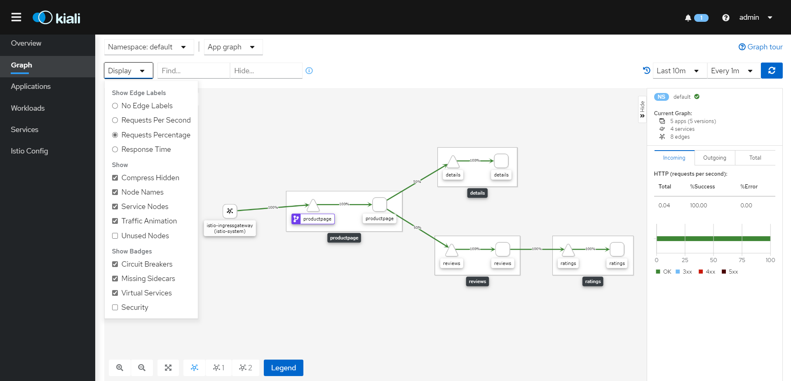</p>
  <br />

### Kiali para producción
  * En el panel lateral izquierdo ➡ Graph. 
  * En la pestaña Display ➡ sección Show Edge Labels ➡ Request Distribution.
  * En la pestaña Display ➡ sección Show ➡ seleccione Compressed Hide, Idle Edges, Service Nodes y Traffic Animation.
  
  <p align=center>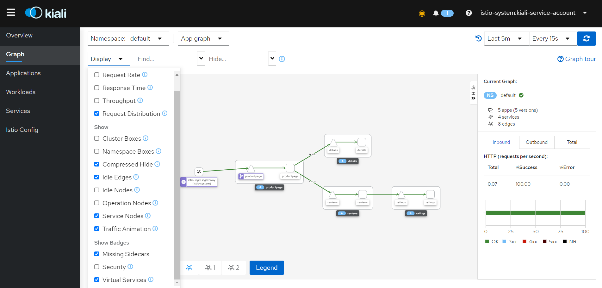</p>
  <br />
  


## Despliegue de servicio de base de datos MongoDB :books:

1. Ejecute el comando para desplegar el servicio (salga de la carpeta ```bin```con ```cd ..```):

   ```
   kubectl apply -f samples/bookinfo/platform/kube/bookinfo-db.yaml
   ```
   <br />

2. Compruebe que se se ha creado un nuevo servicio de mongodb, con el comando:

   ```
   kubectl get services
   ```
   <br />

3. Despliegue una nueva versión del servicio de ratings que consume el servicio de mongodb, coloque el comando:

   ```
   kubectl apply -f samples/bookinfo/platform/kube/bookinfo-ratings-v2.yaml
   ```
   <br />

4. Para poder visualizar en Kiali las versiones, de click la lista que se encuentra al lado derecho del Namespace y seleccione la opción Versioned app graph:

<p align=center>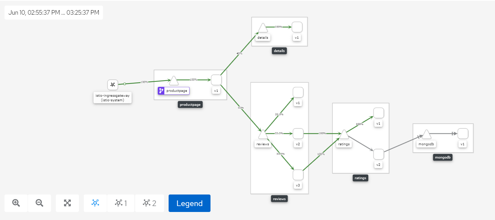</p>
<br />


## Definición de políticas de acceso a la base de datos :closed_lock_with_key:
Es necesario definir nuevas políticas de acceso por medio del enrutamiento del Ingress Gateway a la nueva versión del servicio ratings y al servicio mongodb. Para ello utilice los comandos:

```bash
kubectl apply -f samples/bookinfo/networking/destination-rule-all-mtls.yaml
kubectl apply -f samples/bookinfo/networking/virtual-service-ratings-db.yaml
```
<br />

Solicite nuevamente peticiones a la aplicación con el fin de recibir tráfico en Kiali. Utilice los comandos indicados en [Captura de datos en Kiali](#-Captura-de-datos-en-Kiali).

Finalmente, Kiali mostrará tráfico entrante al servicio de mongodb.

<p align=center>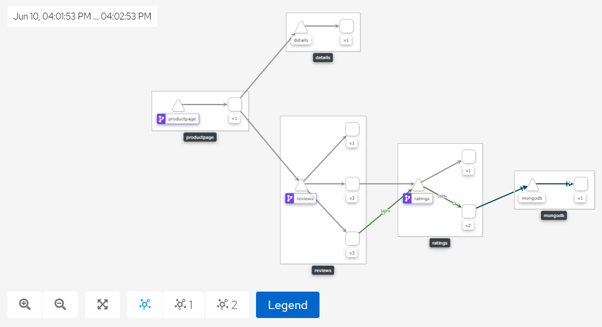</p>
<br />


## Referencias :mag:

- [Documentación Kiali](https://istio.io/docs/tasks/observability/kiali/)

- [Documentación Inicial Istio](https://istio.io/docs/setup/getting-started/#install)

- [IBM Cloud Docs Istio](https://cloud.ibm.com/docs/containers?topic=containers-istio-qs)

- [Autorización de servicios TCP Istio](https://archive.istio.io/v1.3/docs/tasks/security/authz-tcp/)

- [Iniciación a Istio](https://cloud.ibm.com/docs/containers?topic=containers-istio-qs)

- [Compatbilidad de versiones Istio y Kiali](https://kiali.io/documentation/latest/installation-guide/#_version_compatibility)

- [Kiali para ambientes de producción](https://kiali.io/documentation/v1.40/installation-guide/#_helm_chart)

- [Prometheus para escala de producción](https://istio.io/v1.10/docs/ops/best-practices/observability/#using-prometheus-for-production-scale-monitoring)

<br />

## Autores :black_nib:
Equipo *IBM Cloud Tech Sales Colombia*.
