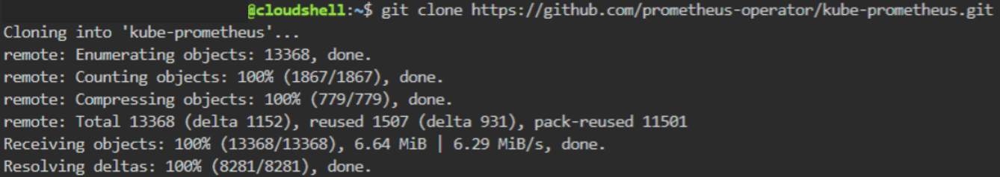
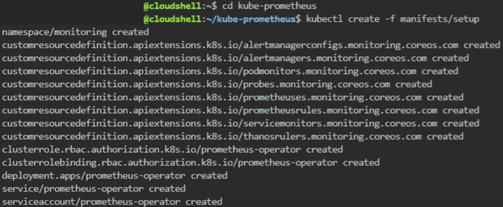
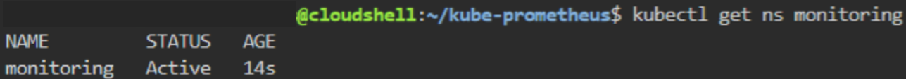
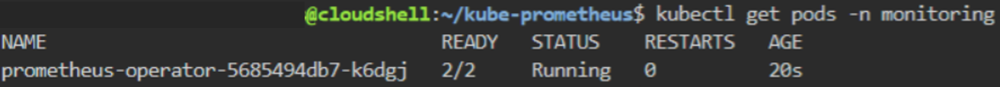
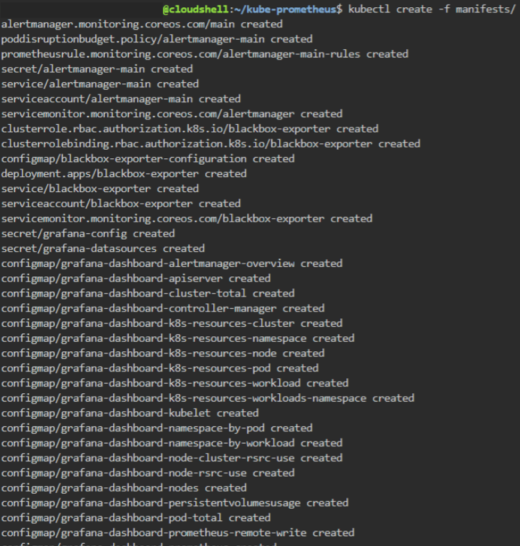
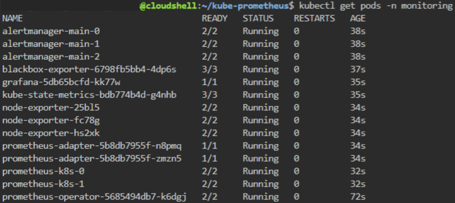
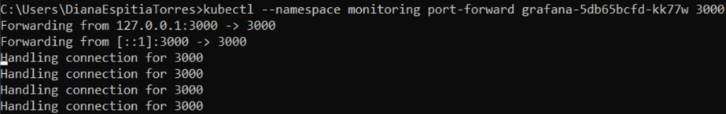
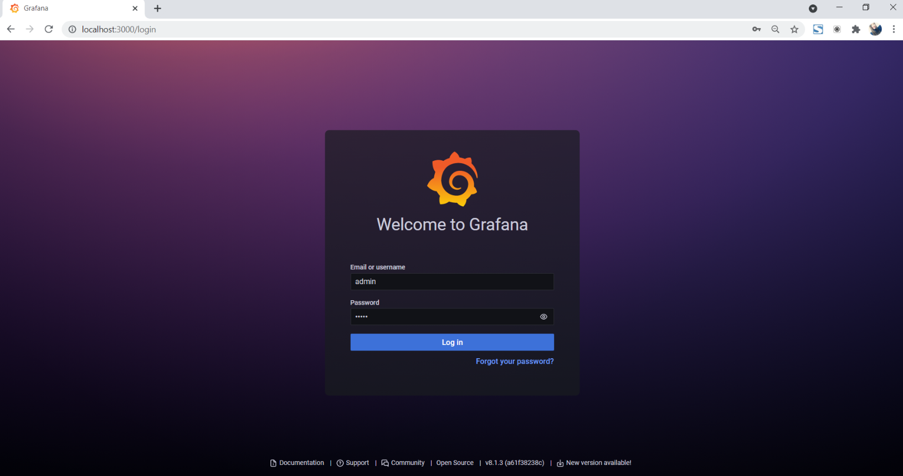
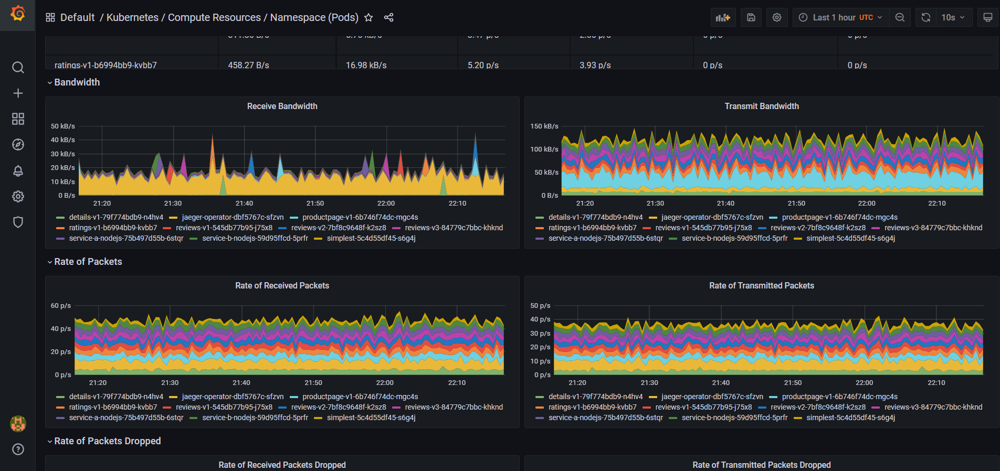

# Monitoreo de Clúster Kubernetes - IBM Cloud ☁

**Disclaimer**: Este repositorio contiene una copia de Istio, todos los archivos han sido descargados del [GitHub Oficial de Istio](https://github.com/istio/istio/releases) y pertenecen a sus respectivos autores.

Esta demo es un acercamiento al concepto de Service Mesh en un Clúster de K8s provisto en IBM Cloud usando Istio y el Dashboard Kiali.

Se usará Istio para administrar configuraciones al Load Balancer, crear rutas entre servicios, realizar transiciones ágiles entre versiones de un servicio y visualizar el Service Mesh con Kiali.

Por otro lado, se instalará el operador de Prometheus para instalar Grafana para producción y poder visualizar y monitorear métricas del clúster de Kubernetes.

<br />

## Tabla de contenido 📑

1. [Requisitos](#Requisitos-newspaper)
2. [Configuración de variables de entorno y acceso al clúster](#Configuración-de-variables-de-entorno-y-acceso-al-clúster-gear)
3. [Instalación de Istio en el Clúster](#Instalación-de-Istio-en-el-Clúster-cloud)
4. [Instalación de Kiali y Prometheus en el Clúster](#Instalación-de-Kiali-y-Prometheus-en-el-Clúster-chart_with_upwards_trend)
5. [Despliegue de la aplicación](#Despliegue-de-la-aplicación-rocket)
6. [Dashboard Kiali](#Dashboard-Kiali-computer)
7. [Captura de datos en Kiali](#Captura-de-datos-en-Kiali-clipboard)
8. [Despliegue de servicio de base de datos MongoDB](#Despliegue-de-servicio-de-base-de-datos-MongoDB-books)
9. [Definición de políticas de acceso a la base de datos](#Definición-de-políticas-de-acceso-a-la-base-de-datos-closed_lock_with_key)
10. [Instalación de Grafana para producción](#Instalación-de-Grafana-para-producción-bar_chart)
11. [Referencias](#Referencias-mag)
12. [Autores](#Autores-black_nib)
<br />

## Requisitos :newspaper:

- Tener un servicio **[Kubernetes Cluster (IKS)](https://cloud.ibm.com/kubernetes/clusters)** disponible en la cuenta IBM Cloud.

  **Importante:** Debe ser un Clúster **pago** en plan **Standard**, puede ser en infraestructura clásica o *VPC*.

- :cloud: [IBM Cloud CLI](https://cloud.ibm.com/docs/cli?topic=cloud-cli-getting-started&locale=en)
- :whale: [Docker](https://www.docker.com/products/docker-desktop)
- [kubectl](https://kubernetes.io/docs/tasks/tools/install-kubectl/). La version de esta herramienta debe ser compatible con la version de IKS que se desplegó en la cuenta.
- Complemento [container-service/kubernetes-service](https://cloud.ibm.com/docs/cli?topic=cli-install-devtools-manually) para ibmcloud CLI. `ibmcloud plugin install container-service/kubernetes-service`.
- Tener instalado [Helm V3](https://github.com/helm/helm/releases) en su computador para instalar el operador de Kiali (para ambientes de producción).
<br />


## Configuración de variables de entorno y acceso al clúster :gear:

1. Clone este repositorio y configure las variables de entorno del ambiente. Para ello, ubíquese en la carpeta clonada del repositorio y en la ruta ```Kubernetes-Seguridad-Istio\istio-1.10.3``` y coloque: 

   * Linux o OSX: 
   ```export PATH=$PWD/bin:$PATH```
   <br />

   * Windows - PowerShell:
   ```powershell
   $path = [Environment]::GetEnvironmentVariable('PATH', 'User')
   $ruta = $PWD
   $newpath = $path + $ruta +'\bin'
   [Environment]::SetEnvironmentVariable("PATH", $newpath, 'User')
   ```
   <br />

2. Configuración del Cluster IKS.
   * Inicie sesión en *IBM Cloud* con el comando:
   
   ```
   ibmcloud login --sso
   ```
   <br />

   * Seleccione la cuenta en donde se encuentra su clúster de Kubernetes.
   <br />

   * Una vez ha iniciado sesión, configure el grupo de recursos y la región que está utilizando su clúster de Kubernetes. Para ello utilice el siguiente comando:
   
   ```
   ibmcloud target -r <REGION> -g <GRUPO_RECURSOS>
   ```
   >**Nota**: Reemplace \<REGION> y <GRUPO_RECURSOS> con su información.
   <br />

   * Obtenga la lista de clústers de Kubernetes que hay en la cuenta establecida:
   
   ```
   ibmcloud cs clusters
   ```
   <br />

   * Verifique el nombre del clúster (```<cluster_name>```) en el que va a trabajar y habilite el comando ```kubectl``` de la siguiente manera:
   
   ```
   ibmcloud ks cluster config --cluster <cluster_name>
   ```
   <br />
   

## Instalación de Istio en el Clúster :cloud:

Para realizar la instalación de Istio en el clúster se porporcionan dos perfiles en esta documentación:
* [Istio demo](#Istio-demo) para ambientes no productivos.
* [Istio para producción](#Istio-para-producción).
<br />

Al momento de realizar este repositorio, la versión más reciente de Istio era la ```1.11```, pero al ser un lanzamiento reciente algunas de sus características y herramientas se encontraban en versión beta. Por este motivo, para la prueba que se presenta en esta documentación se utiliza la versión ```1.10``` para ambientes productivos y no productivos.

Para ejecutar los comandos, dentro de la capeta clonada ```Kubernetes-Seguridad-Istio\istio-1.10.3``` muévase con el comando ```cd``` hasta la carpeta ```bin``` que contiene el ejecutable de istio y allí ejecute los comandos teniendo en cuenta el perfil que desea implementar:
<br />


### Istio demo
Para instalar la versión demo de Istio (ambientes no productivos), siga los pasos que se muestran a continuación:
<br />

1. Una vez ha iniciado sesión y seleccionado el clúster en el que va a trabajar, instale la versión demo de Istio con el comando:

   ```
   istioctl install --set profile=demo
   ``` 
   
   <p align=center></p>
   <br />

2. Habilite la inyección automática de Istio al Envoy Sidecar del clúster. Esto se realiza para un namespace determinado, en este caso use el namespace por defecto (```default```). Coloque el comando:

   ```
   kubectl label namespace default istio-injection=enabled
   ```

   <p align=center></p>
   <br />
<br />

### Istio para producción
Para instalar la versión para ambiente productivos de Istio, siga los pasos que se muestran a continuación:
<br />

1. Una vez ha iniciado sesión y seleccionado el clúster en el que va a trabajar, instale la versión default de Istio con el comando:

   ```
   istioctl install --set profile=default
   ``` 
   
   <p align=center></p>
   <br />

2. Habilite la inyección automática de Istio al Envoy Sidecar del clúster. Esto se realiza para un namespace determinado, en este caso use el namespace por defecto (```default```). Coloque el comando:

   ```
   kubectl label namespace default istio-injection=enabled
   ```

   <p align=center></p>
   <br />
<br />


## Instalación de Kiali y Prometheus en el Clúster :chart_with_upwards_trend:
Kiali es una consola de administración para Istio que permite controlar la malla de servicios. Esta herramienta necesita recuperar datos y configuraciones de Istio, que se exponen a través de Prometheus y la API del clúster, por lo cual, una vez instale Kiali deberá instalar Prometheus. 

Por su parte, Prometheus es una dependencia de Istio. Cuando la telemetría de Istio está habilitada, los datos de las métricas se almacenan en Prometheus para ser mostrados posteriormente en Kiali.

Para realizar la instalación de Kiali y Prometheus en el clúster se proporcionan dos opciones en esta documentación:
* [Kiali y Prometheus demo](#Kiali-y-Prometheus-demo) para ambientes no productivos.
* [Kiali y Prometheus para producción](#Kiali-y-Prometheus-para-producción).
<br />

### Kiali y Prometheus demo
Para instalar la versión demo de Kiali y Prometheus siga los pasos que se muestran a continuación:
<br />

1. Para instalar Kiali en el clúster utilice el siguiente comando:

   ```
   kubectl apply -f https://raw.githubusercontent.com/istio/istio/release-1.10/samples/addons/kiali.yaml
   ```
   
   <p align=center></p>
   <br />

2. Para instalar Prometheus en el clúster utilice el siguiente comando:

   ```
   kubectl apply -f https://raw.githubusercontent.com/istio/istio/release-1.10/samples/addons/prometheus.yaml
   ```
   
   <p align=center></p>
   <br />

<br />

### Kiali y Prometheus para producción
Para instalar la versión de Kiali para ambientes productivos tenga en cuenta la versión de Istio empleada. En la siguiente tabla se muestra la compatibilidad entre versiones:
<br />

| ***Versión de Istio*** | ***Versión de Kiali*** |
|     :---:      |     :---:      |
| 1.11  | 1.38.1 or later |
| 1.10  | 1.34.1 to 1.37.x |
| 1.9  | 1.29.1 to 1.33.x |
| 1.8  | 1.26.0 to 1.28.x |
| 1.7  | 1.22.1 to 1.25.x |
| 1.6  | 1.18.1 to 1.21.x |

Para este caso, la versión empleada de Kiali es la ```1.37.0```. Por otro lado, para entornos de producción en Kubernetes, se debe instalar el ```Kiali Operator Helm Chart```. Durante la instalación de este operador, se instala también el Kiali CR (activa la instalación del servidor de Kiali en el namespace de istio). Para ello, complete los siguientes pasos:

1. Cree un namespace en donde quedará instalado el ```kiali-operator```, utilice el comando:

   ```
   kubectl create namespace kiali-operator
   ```
   <br />

2. Instale el ```kiali-operator``` en el namespace que acaba de crear (```kiali-operator```) junto con el servidor de Kiali en el namespace del sistema isito (```istio-system```). Asegúrese de tener instalado el comando helm (puede que deba cambiar de carpeta hasta la ubicación que contiene el ejecutable) y posteriomente coloque el comando:
   ```
   helm install --set cr.create=true --set cr.namespace=istio-system --namespace kiali-operator --repo https://kiali.org/helm-charts --version 1.37.0 kiali-operator kiali-operator 
   ```
   <br />

3. Asegúrese de que el operador de Kiali se encuentre instalado en el namespace ```kiali-operator``` y que el servidor de Kiali se encuentre en el namespace ```istio-system```.
   
   <p align=center></p>
   <br />

Para el caso de Prometheus, se recomienda para ambientes de producción implementar federación jerárquica y reglas. Cuando se implementa Prometheus en versión demo la ventana de retención es muy corta (6 horas), por lo cual se realizan una serie de configuraciones para contar con rangos mayores en la colección de métricas y así poder realizar monitoreo a escala de producción. 

<br />

   <p align=center></p>
   <br />

Complete los siguientes pasos para configurar Prometheus a escala de producción:

1. Para instalar Prometheus en el clúster utilice el siguiente comando:

   ```
   kubectl apply -f https://raw.githubusercontent.com/wavefrontHQ/integrations/master/istio/prometheus.yaml
   ```
   
   <p align=center></p>
   <br />
   
   > NOTA: En caso de que el enlace falle al momento de realizar la instalación, en el respositorio puede encontrar el archivo ```prometheus.yaml```que contiene las configuraciones de federación jerárquica y reglas para ambientes a escala de producción. Por lo tanto, puede utilizar ese archivo para desplegar Prometheus a escala de producción. 

2. Verifique que Prometheus se ha instalado en el namespace ```istio-system```. 

   <p align=center></p>
<br />


## Despliegue de la aplicación :rocket:

1. Aplicación bookinfo.

   * El primer paso consiste en desplegar la aplicación de ejemplo Bookinfo que está en la carpeta ```samples``` del repositorio. Para ello, salga de la carpeta ```bin``` con el comando ```cd..``` y asegúrese de quedar en la ruta ```Kubernetes-Seguridad-Istio\istio-1.10.3``` donde se ubica la carpeta ```samples```. Luego coloque el comando:

     ```
     kubectl apply -f samples/bookinfo/platform/kube/bookinfo.yaml
     ```

     Este comando creará todo el despliegue en el clúster, es decir, Deployment, Service, Pods y réplicas.

   * Visualice los servicios implementados en el clúster con el comando:

     ```
     kubectl get services
     ```

     <p align=center></p>
     <br />

   * Visualice los pods implementados en el clúster con el comando:

     ```
     kubectl get pods
     ```

     <p align=center></p>
     <br />

2. El paso siguiente consiste en exponer al exterior el clúster y definir las políticas de acceso. Para ello, se debe configurar la aplicación para aceptar trafico externo, agregando el Istio Ingress Gateway, que se encargará de gestionar las rutas de nuestro Service Mesh.

   Por defecto, el ingress gateway se encarga de bloquear todas las solicitudes, permitiendo únicamente las definidas en las políticas de acceso. Utilice el comando:

   ```
   kubectl apply -f samples/bookinfo/networking/bookinfo-gateway.yaml
   ```

   <p align=center></p>
   <br />

3. Defina la configuración de enrutamiento donde se especifica a que servicios se puede acceder desde el exterior. Para ello utilice el archivo destination-rule-all.yaml mediante el comando:

   ```
   kubectl apply -f samples/bookinfo/networking/destination-rule-all.yaml
   ```

   <p align=center></p>
   <br />

4. Para continuar con el ejercicio y ejecutar la aplicación, utilice los siguientes comandos:

   ### Clúster de Infraestructura Clásica 
   <br />
   Si trabaja con un clúster de infraestructura clásica, deberá obtener la dirección ip y el puerto. Para ello siga estos pasos:

   * Obtener Dirección IP:

   ```
   kubectl -n istio-system get service istio-ingressgateway -o jsonpath='{.status.loadBalancer.ingress[0].ip}'
   ```

   <p align=center></p>
   <br />

   * Obtener Puerto:

   Terminal de Linux & OSX

   ```
   kubectl -n istio-system get service istio-ingressgateway -o jsonpath='{$.spec.ports[?(@.name=="http2")].nodePort}'
   ```
   <br />

   PowerShell:

   ```
   kubectl -n istio-system get service istio-ingressgateway -o jsonpath='{$.spec.ports[?(@.name==\"http2\")].nodePort}'
   ```

   <p align=center></p>
   <br />

   Ahora verifique que sea posible acceder mediante el comando:

   ```
   curl -o /dev/null -s -w "%{http_code}\n" http://169.63.6.234/productpage
   ```

   La salida debe ser 200.
   
   <p align=center>
   <br />

   También puede realizar la prueba por el navegador accediendo a la dirección `http://169.64.6.235/productpage`

   <p align=center></p>
   <br />


   ### Clúster en VPC
   <br />
   Si trabaja con un clúster en VPC, deberá obtener el endpoint. Para ello siga estos pasos:

   * Obtener endpoint:

   ```
   kubectl -n istio-system get service istio-ingressgateway -o jsonpath='{.status.loadBalancer.ingress[0].hostname}'
   ```
   <br />

   Ahora verifique que sea posible acceder a la aplicación por el navegador accediendo a la dirección con:
   ```
   http://<endpoint>/productpage
   ```

   Ejemplo:
   ```
   http://3401ba17-us-south.lb.appdomain.cloud/productpage
   ```

   <br />


## Dashboard Kiali :computer:

Para acceder al dashboard de Kiali, tenga en cuenta las siguientes opciones según el ambiente en el que trabaja su clúster:
* [Kiali demo](#Kiali-demo).
* [Kiali para producción](#Kiali-para-producción).
<br />


### Kiali demo
Para visualizar y acceder a Kiali en la versión para ambientes no productivos, vaya a la carpeta ```bin``` (ya que esta carpeta contiene el ejecutable de Kiali) con ```cd bin``` (que se encuentra dentro de la carpeta clonada ```Kubernetes-Seguridad-Istio\istio-1.10.3```) y coloque el comando:

```
istioctl dashboard kiali
```

Una vez aplique el comando, obtendrá como respuesta ```http://localhost:puerto```, donde puerto es un valor aleatorio. Si de forma automática no se abre esta URL en el navegador, colóquela de forma manual. Allí le aparecerá una ventana para acceder a Kiali. En las credenciales de usuario y contraseña coloque **admin**.

<p align=center></p>
<br />

### Kiali para producción
Para visualizar y acceder a Kiali en la versión para ambientes productivos, puede realizarlo de 2 formas:
<br />

* **Opción 1:**
  
  Vaya a la carpeta ```bin``` (ya que esta carpeta contiene el ejecutable de Kiali) con ```cd bin``` (que se encuentra dentro de la carpeta clonada ```Kubernetes-Seguridad-Istio\istio-1.10.3```) y coloque el comando:

  ```
  istioctl dashboard kiali
  ```

  Una vez aplique el comando, obtendrá como respuesta ```http://localhost:20001/kiali```. Si de forma automática no se abre esta URL en el navegador, colóquela de forma manual. Allí le aparecerá una ventana para acceder a Kiali. En las credenciales de acceso le piden un token del Kubernetes Service Account. Los pasos para obtener este token se presentarán más adelante.
  <br />
  
  <p align=center></p>
  <br />

* **Opción 2:**
 
  En el overview de su clúster visualice y copie el ```Ingress subdomain```. Posteriormente colóquelo en el navegador agregando al final ```/kiali``` y espere a que la ventana cargue.

  ```
  <Ingress subdomain>/kiali
  ```
  
  <p align=center></p>
  <br />
  
  En las credenciales de acceso le piden un token del Kubernetes Service Account. Los pasos para obtener este token se presentarán más adelante.
  
  <br />
  
  <p align=center></p>
  <br />
 
Para obtener el token de acceso realice lo siguiente:

1. Obtenga los secrets del namescape ```istio-system``` con el siguiente comando:
  ```
  kubectl get secrets -n istio-system
  ```
  <br />

2. Visualice el secret que corresponde a ```kiali-service-account-token-xxxxx``` y aplíquelo en el siguiente comando:
  ```
  kubectl describe secrets/kiali-service-account-token-xxxxx -n istio-system
  ```
  <br />
  
  Ejemplo:
  
  ```
  kubectl describe secrets/kiali-service-account-token-9jg27 -n istio-system
  ```
  <br />
  
  Posteriormente aparecerá el token de acceso que deberá colocar en la ventana de Kiali para acceder a las métricas.
  
  <br />
  
  <p align=center></p>
  <br />


## Captura de datos en Kiali :clipboard:

Una vez a accedido a Kiali, seleccione en el panel izquierdo ```Graph``` y filtre por el namespace en el que desplegó la aplicación. Como no se han generado solicitudes a la aplicación y el resultado de la gráfica será:  **Empty Graph**.

Para generar una cantidad considerable de solicitudes y así poder visualizar el tráfico en el Service Mesh, en una nueva ventana use el comando:

### Windows PowerShell:

* Clúster en infraestructura clásica:
```powershell
$i = 1
do
{
   $Response = Invoke-WebRequest -URI http://169.63.6.234/productpage
   $Response.StatusCode
   $i++
}
while ($i -le 10)
```

* Clúster en VPC:
```powershell
$i = 1
do
{
   $Response = Invoke-WebRequest -URI http://3401ba17-us-south.lb.appdomain.cloud/productpage
   $Response.StatusCode
   $i++
}
while ($i -le 10)
```

### Linux & OSX:

* Clúster en infraestructura clásica:

```bash
for ((i = 0; i < 10; i++)); do
    curl -o /dev/null -s -w "%{http_code}\n" http://169.63.6.234/productpage
done
```

* Clúster en VPC:
```bash
for ((i = 0; i < 10; i++)); do
    curl -o /dev/null -s -w "%{http_code}\n" http://3401ba17-us-south.lb.appdomain.cloud/productpage
done
```
<br />

Revise nuevamente la ventana que muestra Kiali y asegúrese de tener seleccionado lo siguiente según la versión de Kiali implementada:

### Kiali demo
  * En el panel lateral izquierdo ➡ Graph. 
  * En la pestaña Display ➡ sección Show Edge Labels ➡ Request Percentage.
  * En la pestaña Display ➡ sección Show ➡ seleccione Compress Hidden, Node Names, Service Nodes y Traffic Animation.

  <p align=center></p>
  <br />

### Kiali para producción
  * En el panel lateral izquierdo ➡ Graph. 
  * En la pestaña Display ➡ sección Show Edge Labels ➡ Request Distribution.
  * En la pestaña Display ➡ sección Show ➡ seleccione Compressed Hide, Idle Edges, Service Nodes y Traffic Animation.
  
  <p align=center></p>
  <br />
  


## Despliegue de servicio de base de datos MongoDB :books:

1. Ejecute el comando para desplegar el servicio (salga de la carpeta ```bin```con ```cd ..```):

   ```
   kubectl apply -f samples/bookinfo/platform/kube/bookinfo-db.yaml
   ```
   <br />

2. Compruebe que se se ha creado un nuevo servicio de mongodb, con el comando:

   ```
   kubectl get services
   ```
   <br />

3. Despliegue una nueva versión del servicio de ratings que consume el servicio de mongodb, coloque el comando:

   ```
   kubectl apply -f samples/bookinfo/platform/kube/bookinfo-ratings-v2.yaml
   ```
   <br />

4. Para poder visualizar en Kiali las versiones, de click la lista que se encuentra al lado derecho del Namespace y seleccione la opción Versioned app graph:

<p align=center></p>
<br />


## Definición de políticas de acceso a la base de datos :closed_lock_with_key:
Es necesario definir nuevas políticas de acceso por medio del enrutamiento del Ingress Gateway a la nueva versión del servicio ratings y al servicio mongodb. Para ello utilice los comandos:

```bash
kubectl apply -f samples/bookinfo/networking/destination-rule-all-mtls.yaml
kubectl apply -f samples/bookinfo/networking/virtual-service-ratings-db.yaml
```
<br />

Solicite nuevamente peticiones a la aplicación con el fin de recibir tráfico en Kiali. Utilice los comandos indicados en [Captura de datos en Kiali](#-Captura-de-datos-en-Kiali).

Finalmente, Kiali mostrará tráfico entrante al servicio de mongodb.

<p align=center></p>
<br />


## Instalación de Grafana para producción :bar_chart:
Grafana es una herramienta que permite analizar y visualizar métricas. Cuando se trata de monitorear un clúster en producción, el trabajar Prometheus y Grafana en conjunto se convierte en una excelente solución. Para este caso, se emplea el ```prometheus-operator```, diseñado para facilitar la implementación y gestión de Prometheus. Al instalar el operador como se inidica en este repositorio también instalará Grafana. Complete los siguientes pasos:
<br />

1. Asegúrese de iniciar sesión, configurar la región y grupo de recursos y seleccionar el clúster de Kubernetes en el que desea instalar Grafana. Para esto, recuerde seguir los pasos de *acceso al clúster* en el ítem 2 que se indica en el paso [Configuración de variables de entorno y acceso al clúster](#Configuración-de-variables-de-entorno-y-acceso-al-clúster-gear)
<br />

2. Clone el repositorio ```https://github.com/prometheus-operator/kube-prometheus```. Para ello coloque el comando:
```
git clone https://github.com/prometheus-operator/kube-prometheus.git
```
<br />

<p align=center></p>
<br />

3. Cambie de directorio a la carpeta clonada con el comando:
```
cd kube-prometheus
```
<br />

4. Cree una namespace para la instalación del operador junto con las definciones de recursos personalizadas que se necesitan. Para ello coloque:
```
kubectl create -f manifests/setup
```
<br />

<p align=center></p>
<br />

5. Verifique el estado del namespace creado con:
```
kubectl get ns monitoring
```
<br />

<p align=center></p>
<br />

6. Confirme que el pod del operador que ha instalado se esté ejcutando de forma correcta. Utilice el comando:
```
kubectl get pods -n monitoring
```
<br />

<p align=center></p>
<br />

7. Implemente la pila de monitoreo de Kubernetes. Para ello coloque:
```
kubectl create -f manifests/
```
<br />

<p align=center></p>
<br />

8. Espero unos minutos mientras se completa la implementación, identifique el pod de grafana y tenga en cuenta su nombre para usarla más adelante. Posteriormenete, visualice de nuevo los pods en el namespace creado con:
```
kubectl get pods -n monitoring
```
<br />

<p align=center></p>
<br />

9. Verifique que los servicios se han creado de forma exitosa. Coloque el comando:
```
kubectl get svc -n monitoring
```
<br />

<p align=center></p>
<br />

10. Acceda al panel de Grafana reenviando la conexión del puerto del pod a un puerto local que no esté usando su máquina (ejemplo: ```3000```). Para ello, emplee el siguiente comando en el cual deberá colocar el nombre del pod de grafana:
```
kubectl --namespace monitoring port-forward pod_grafana 3000
```
<br />

Ejemplo:

```
kubectl --namespace monitoring port-forward grafana-5db65bcfd-kk77w 3000
```
<br />

<p align=center></p>
<br />

11. Una vez cargue la ventana de Grafana deberá colocar el usuario y contraseña para poder acceder al Dashboard. Para este casos coloque:
    * ```Email or username```: admin
    * ```Password```: admin
    
    Luego de colocar las credenciales y dar click en el botón ```Log in``` se le solicitará que cambie la contraseña. 
    
    <p align=center></p>
    <br />

12. Para finalizar explore los diferentes paneles en el dashboard y visualice las respectivas métricas.

    <p align=center></p>
    <br />

## Referencias :mag:

- [Documentación Kiali](https://istio.io/docs/tasks/observability/kiali/)

- [Documentación Inicial Istio](https://istio.io/docs/setup/getting-started/#install)

- [IBM Cloud Docs Istio](https://cloud.ibm.com/docs/containers?topic=containers-istio-qs)

- [Autorización de servicios TCP Istio](https://archive.istio.io/v1.3/docs/tasks/security/authz-tcp/)

- [Iniciación a Istio](https://cloud.ibm.com/docs/containers?topic=containers-istio-qs)

- [Compatbilidad de versiones Istio y Kiali](https://kiali.io/documentation/latest/installation-guide/#_version_compatibility)

- [Kiali para ambientes de producción](https://kiali.io/documentation/v1.40/installation-guide/#_helm_chart)

- [Prometheus para escala de producción](https://istio.io/v1.10/docs/ops/best-practices/observability/#using-prometheus-for-production-scale-monitoring)

<br />

## Autores :black_nib:
Equipo *IBM Cloud Tech Sales Colombia*.
